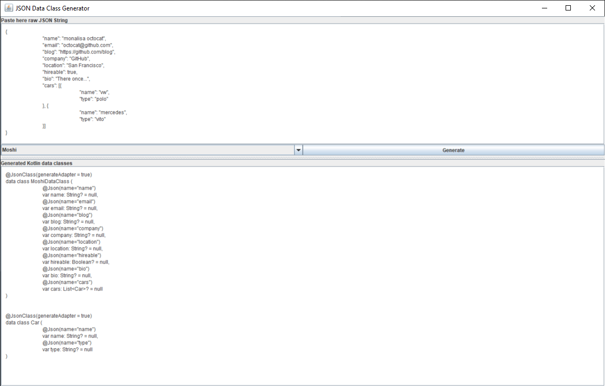
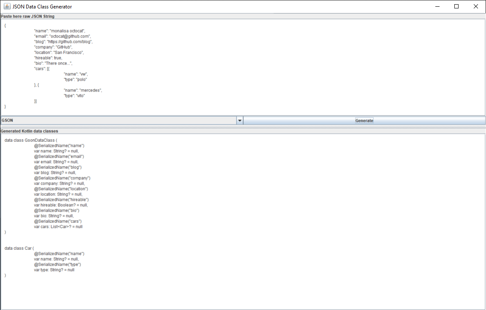

# Android-Data-Class-Generator
Project and executable JAR file to simplify your Kotlin Data classes creation. Simply paste your raw JSON string and copy the generated class in your project

### Simply to use:
- Run the JsonClassGenerator.jar
- Paste the raw JSON string
- Choose if you want Moshi or Gson data classes
- Click Generate
- Copy and paste the generated output direclty into your Kotlin project 
- Rename classes as desired

### Preview

|   |  |
| --- | --- |

### 3rd Party library that project uses:
- [Google GSON](https://github.com/google/gson/blob/master/LICENSE)